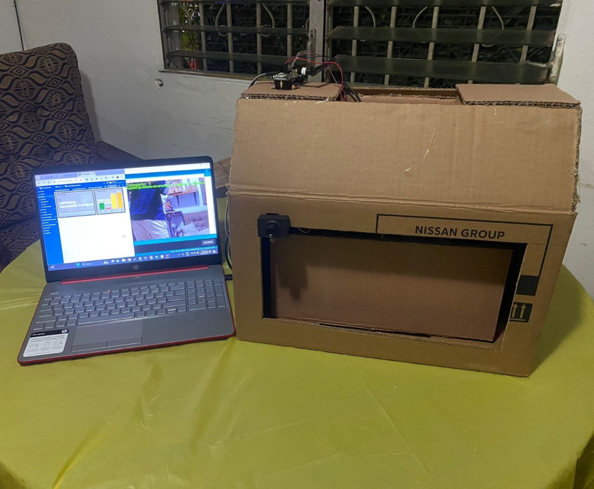
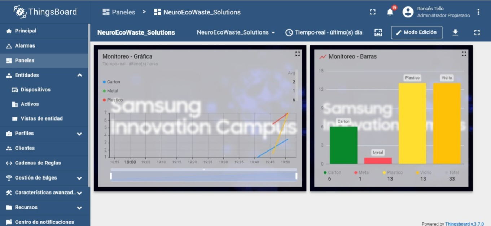
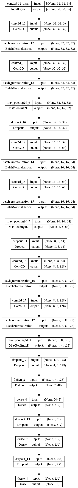
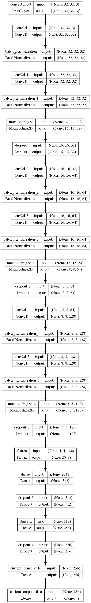
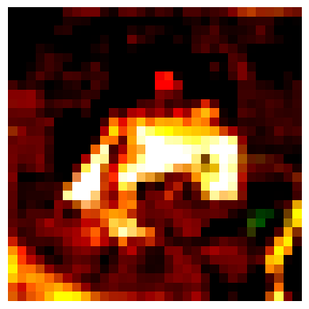
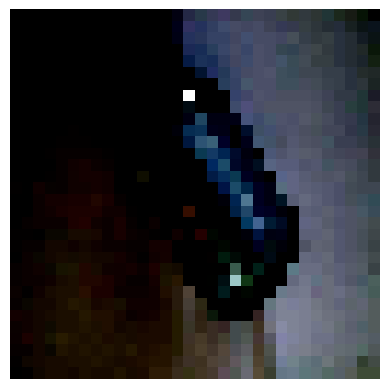
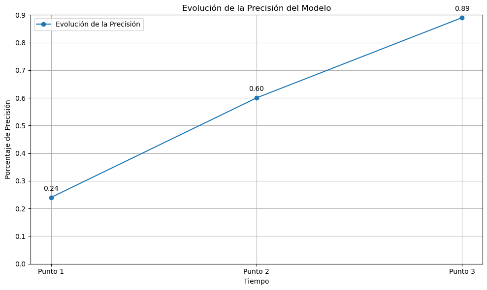

# NeuroEcoWasteSolutions

## Tabla de contenidos

1. [Descripción](#SmartWaste-Station)
2. [Arquitectura](#Arquitectura-del-Proyecto)
3. [Proceso](#Proceso-de-Desarrollo)

## SmartWaste Station

  El proyecto consiste en una estación de clasificación de basura. La estación reconocerá la basura a través de una cámara (el de una computadora portátil para este prototipo), las clasificará a través de una red neuronal y la depositará en un contenedor específico dependiendo de la clasificación (vidrio, cartón, metal, plástico). 

   
  

    <strong>Imagenes del Proyecto</strong>
  

   
  

    
  

   

   
  

    
  

   

## Arquitectura del Proyecto
    
  El proyecto sigue una arquitectura de transferencia de aprendizaje. Primero, desarrollamos y entrenamos un modelo de clasificación de imágenes usando el dataset CIFAR-10. Luego, utilizamos este modelo preentrenado y ajustamos las últimas capas para adaptarlo a la tarea de clasificar imágenes de basura en cuatro categorías.

   

  

    <strong>Arquitctura del modelo CIFAR-10</strong>
  

  

    
  

    

  

    <strong>Arquitectura del modelo Principal</strong>
  

  

    
  

   

## Proceso de Desarrollo
- Fuente del dataset
  
  El dataset utilizado para el proyecto se encuentra en el directorio "4Clases/", que contiene subdirectorios para cada una de las cuatro clases de imágenes.
  Este es la combinación de 3 datasets diferentes, los cuales son:
  * https://www.kaggle.com/datasets/mostafaabla/garbage-classification
  * https://www.kaggle.com/datasets/farzadnekouei/trash-type-image-dataset
  * https://www.kaggle.com/datasets/sumn2u/garbage-classification-v2
  
  A su vez se utilizo el dataset cifar10 para el entrenamiento del modelo base que posteriormente se utilizo para entrenar el modelo principal.
  * https://www.cs.toronto.edu/~kriz/cifar.html

- Limpieza de datos (img que lo valide)
  
  Se normalizaron los datos de imágenes utilizando z-score (media y desviación estándar). Aqui se muestra una imagen despues de la normalizacion:
  
   

  

    <strong>CIFAR-10</strong>
  

  

    
  

    

  

    <strong>Modelo Principal</strong>
  

  

    
  

   

- ¿Qué modelo de Machine Learning están usando?
  - Modelo CIFAR-10
      
      Primero, desarrollamos y entrenamos un modelo de clasificación de imágenes usando el dataset CIFAR-10. La arquitectura del modelo es la siguiente:

      - Capa de Convolución: Se utilizan múltiples capas de convolución con activaciones ReLU y regularización L2.
      - Capa de Agrupamiento: Se aplican capas de MaxPooling para reducir la dimensionalidad.
      - Batch Normalization: Se normalizan las salidas de las capas de convolución.
      - Dropout: Se usan capas de Dropout para prevenir el sobreajuste.
      - Capas Densas: Finalmente, el modelo tiene capas densas con activación ReLU y una capa de salida con activación softmax para las 10 clases de CIFAR-10.

      El modelo se entrenó con técnicas de aumento de datos y callbacks como detención temprana y reducción de la tasa de aprendizaje. Tras el entrenamiento, el modelo se guardó como cifar10.h5.

  - Modelo de Clasificación de Basura
      
      Usamos el modelo CIFAR-10 preentrenado y ajustamos las últimas capas para clasificar imágenes de basura en cuatro categorías. La arquitectura del modelo es la siguiente:

      - Carga del Modelo Preentrenado: Se carga el modelo CIFAR-10 entrenado por nosotros.
      - Congelación de Capas: Se congelan todas las capas excepto las últimas cinco para conservar las características aprendidas del CIFAR-10.
      - Ajuste de las Últimas Capas:
          - Capa Densa Adicional: Se agrega una capa densa con 256 neuronas y activación ReLU.
          - Capa de Salida: Se agrega una capa de salida con activación softmax para las cuatro clases de basura.
      - Compilación del Modelo: El modelo se compila con el optimizador Adam y la función de pérdida categorical_crossentropy.
      - Entrenamiento del Modelo: Se entrena el modelo con el conjunto de datos de basura, utilizando técnicas de detención temprana y reducción de la tasa de aprendizaje.
      - Evaluación del Modelo: Se evalúa el modelo en un conjunto de prueba separado, calculando la precisión global.

- Estadísticos (Valores, gráficos, …)
      El avance de la presición del modelo fue el siguiente:

   
  

    
  

   

- Métrica(s) de evaluación del modelo
      
  El modelo se evalúa utilizando la precisión, obteniendo una precisión global del {valor}%.

